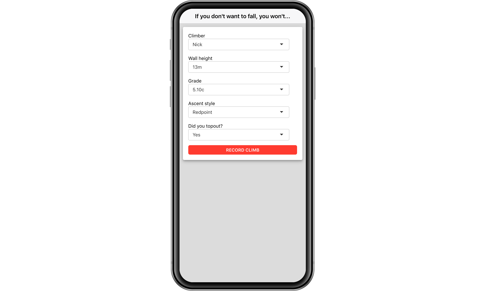

# ClimbOn

ClimbOn is a simple [shinyMobile](https://rinterface.github.io/shinyMobile/) app for collecting personal climbing data. 

The data can be imported into R using the [`climblogs`](https://github.com/nt-williams/climblogs) :package:

 

